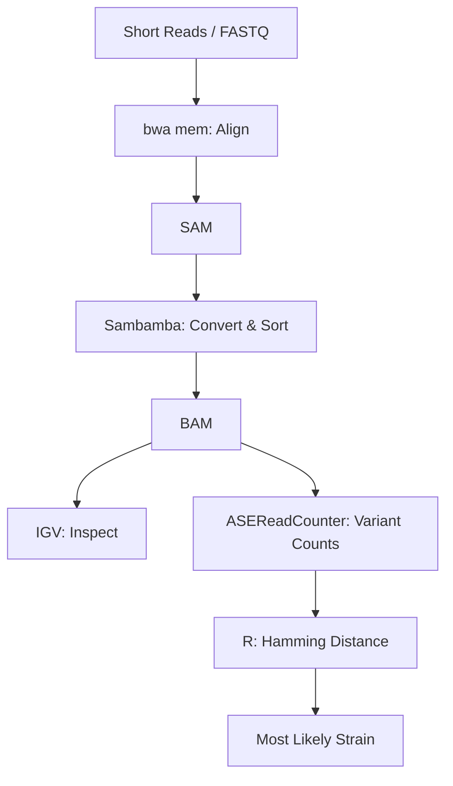

# Tutorial 3 - Analyzing Short-Read Sequencing Data

After identifying a gene × environment interaction effect in **Tutorial #2**, the lab decides that the best course of action is to cross the **BY lab strain** to a wild isolate and use QTL mapping to find the genetic locus or loci contributing the the different growth effects in Chemical X.  

First, in each strain the **HO endonuclease gene** was disabled. Why was this necessary? Then BY was mated to one of the wild isolates. The resulting hybrid diploid was grown clonally, and then this culture was sporulated.

Heriberto tetrad dissected this culture. He dissected over 100 tetrads and then chose one of the progeny from each tetrad to build a QTL mapping panel. He then prepared short-read DNA sequencing libraries for each of the segregants and for the parent strain that BY was crossed to, using our homebrew **TN5-based library protocol**.  

> **Note:** The BY strain is the reference genome for *S. cerevisiae*.  

Unfortunately, no one kept track of which wild isolate strain BY was crossed to.  All the data you need to do the analyses below can be found on [`Dropbox`](https://www.dropbox.com/scl/fo/dqwsq05s7pgpwi6afnniw/AO9g05Qm-plqOhamdPbQrFE?rlkey=szf7za9204ozuzjgecrwxpirw&st=svx2bivm&dl=0).

---

## 1. Determine the Strain Identity of the Mystery Strain

1. Manually use **NCBI BLAST** to take a few short reads from the mystery strain and evaluate whether they are coming from yeast.  
2. Assuming they are, use the tool **bwa mem** (see below) to align the paired-end reads to the reference genome `sacCer3.fasta` (provided).  
3. Pipe the output of `bwa mem` to **sambamba** (see below) to convert the output SAM into a BAM-formatted file, and then sort the BAM file.  
4. Once you have created a BAM file, visualize the short-read alignments in **IGV**. Look at the first 10–20 Kbp on **ChrI**.  
   - What do you see?  
   - Does it make sense?  

You may choose to use Hoffman2 to do this analysis. If so, I recommend you use conda (or the drop-in replacement mamba) to manage and automate the installation of necessary software to do these analyses.
### Example HPC Commands

```bash
# Connect to Hoffman2 cluster (access login node).
ssh username@hoffman2.idre.ucla.edu

# Request a compute node (example: 48 hours, 8G RAM, 8 threads). Never do compute on login node.
qrsh -l highp,h_rt=48:00:00,h_data=8G -pe shared 8
```

### Environment Setup

```bash
# Load mamba module
module load mamba

# Configure conda channels
conda config --add channels defaults
conda config --add channels bioconda
conda config --add channels conda-forge
conda config --set channel_priority strict

# Create conda environment with required tools
mamba create --name genomics bwa gatk4 bcftools sambamba

# Activate the environment
mamba activate genomics
```

### Variant Analysis

1. Use **GATK ASEReadCounter** to identify the counts of variants at known biallelic variant sites.  
   - Known variant sites: `mega_filtered.vcf.gz` (and its associated `.tbi` file).  

2. Load this table into **R**:  
   - Classify any site with more alternate variant counts than reference variant counts as having the **alternate variant**.  
   - Code alternate variants as `1` and reference variants as `0`.  

3. Calculate the **Hamming distance** between:  
   - The observed genotypes for the mystery strain  
   - Each of the wild isolate genotypes (see `sparseMatrixGeno1011.RDS`).  

4. Use the Hamming distance to determine the most likely strain match.  

**Question:** What is the mystery strain?  

---
## Pipeline Overview


---

## 2. Visualize Meiotic Crossovers in a Haploid Yeast Segregant

1. Use the same pipeline as above to align short reads from the **first segregant** and call genotypes.  
2. Call genotypes at the variant sites that are expected between **BY (reference)** and the identified **mystery strain** only.  
3. Recode:  
   - BY variants as `0`  
   - RM variants as `+1`  

4. Visualize the inheritance of the variants across the genome.  

**By eye:**  
- How many crossovers do you see per chromosome (specify a range)?

---


